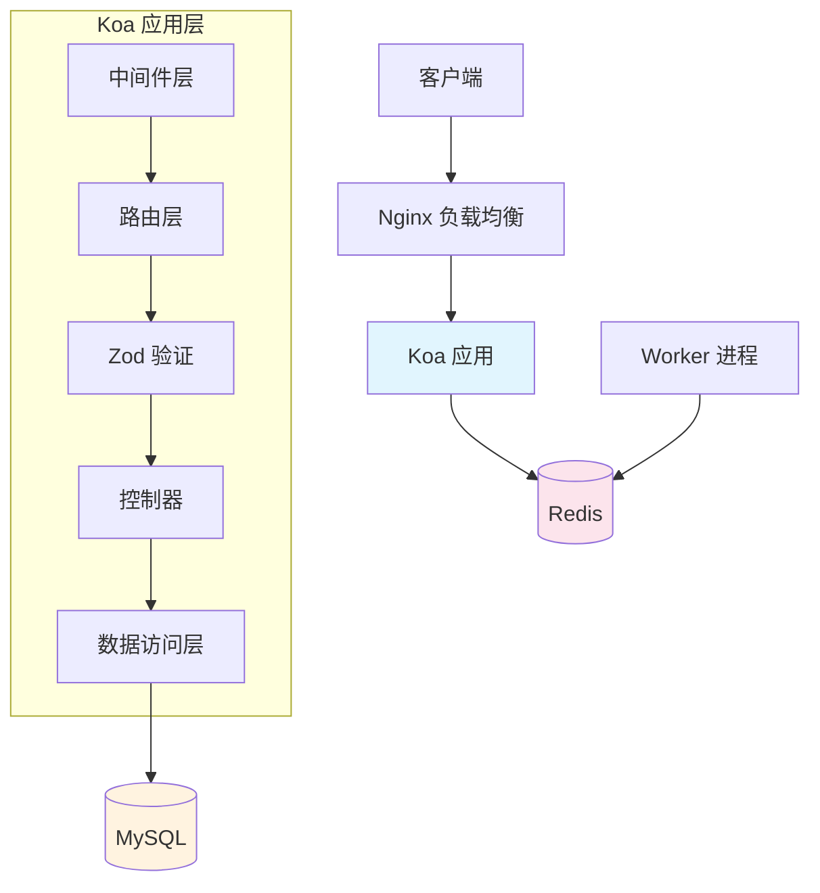
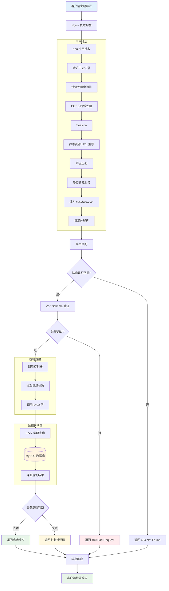

# 项目架构与技术栈说明

## 1. 技术栈概览

| 类别 | 技术 | 版本 | 说明 |
|------|------|------|------|
| **核心框架** | Koa | 3.2.x | 轻量级 Node.js Web 框架 |
| **运行时** | Node.js | 22.x | ES Modules 原生支持 |
| **数据库** | MySQL | 8.x | 关系型数据库 |
| **查询构建器** | Knex.js | 3.x | SQL 查询构建器 |
| **参数校验** | Zod | 4.x | TypeScript-first 验证库 |
| **日志系统** | Pino | 10.x | 高性能 JSON 日志 |
| **密码加密** | bcryptjs | 2.x | 密码哈希 |
| **认证** | JWT | 9.x | JSON Web Token |
| **进程管理** | PM2 | - | 生产环境进程管理 |
| **任务队列** | Bull | 4.x | Redis 任务队列 |

---

## 2. 目录结构

```
src/
├── app.js                 # 应用入口
├── worker.js              # 后台任务 Worker
├── config/                # 配置文件
│   ├── setting.js         # 环境变量配置
│   ├── knex.js            # 数据库连接
│   ├── logger.js          # 日志配置
│   ├── cors.js            # 跨域配置
│   ├── koaBodyConfig.js   # 请求体解析配置
│   ├── httpError.js       # HTTP 状态码
│   └── businessCode.js    # 业务状态码
├── middleware/            # Koa 中间件
│   ├── authenticate.js    # JWT 认证
│   ├── validationMiddleware.js  # Zod 验证
│   ├── error.js           # 错误处理
│   ├── logger.js          # 请求日志
│   └── compress.js        # 响应压缩
├── routers/               # 路由定义
│   ├── index.js           # 路由入口
│   └── router/
│       └── usersRouter.js # 用户路由
├── controllers/           # 控制器
│   └── users/
│       └── userController.js
├── models/                # 数据模型
│   └── dao/
│       └── usersDao.js    # 用户数据访问
├── schemas/               # Zod Schema 定义
│   ├── authSchemas.js     # 认证相关
│   └── models/
│       └── userEntitySchema.js
├── utils/                 # 工具函数
│   ├── createResponse.js  # 响应格式化
│   ├── password.js        # 密码加密
│   ├── jwt.js             # JWT 工具
│   └── db.js              # 数据库工具 (兼容旧代码)
└── jobs/                  # 后台任务
    ├── queue.js           # 队列定义
    ├── scheduler.js       # 定时任务
    └── processors/        # 任务处理器
```

---

## 3. 系统架构



---

## 4. 请求处理流程



---

## 5. 技术栈使用指南

### 5.1 Knex 数据库查询

**配置文件**: `src/config/knex.js`

```javascript
import { db } from '../config/knex.js'

// 查询单条
const user = await db('users').where({ id: 1 }).first()

// 查询多条
const users = await db('users').where('age', '>', 18).select('id', 'name')

// 插入
const [id] = await db('users').insert({ name: 'John', age: 25 })

// 更新
await db('users').where({ id: 1 }).update({ name: 'Jane' })

// 删除
await db('users').where({ id: 1 }).del()

// 事务
await db.transaction(async (trx) => {
  await trx('users').insert({ name: 'John' })
  await trx('orders').insert({ user_id: 1 })
})
```

---

### 5.2 Zod 参数验证

**Schema 定义**: `src/schemas/models/userEntitySchema.js`

```javascript
import { z } from 'zod'

// 定义 Schema
export const LoginBodySchema = z.object({
  username: z.string().min(1, '用户名不能为空'),
  password: z.string().min(6, '密码至少6位')
})

// 可选字段
export const UpdateUserSchema = z.object({
  name: z.string().optional(),
  age: z.number().int().positive().optional()
})

// 自定义验证
export const PasswordSchema = z.string()
  .regex(/^[a-zA-Z]\w{5,17}$/, '密码格式不正确')
```

**路由中使用**:

```javascript
import { validateBody, validateQuery } from '../../middleware/validationMiddleware.js'

// POST 请求验证 body
router.post('/login', validateBody(LoginBodySchema), controller.login)

// GET 请求验证 query
router.get('/users', validateQuery(QuerySchema), controller.list)
```

---

### 5.3 密码加密

**工具文件**: `src/utils/password.js`

```javascript
import { hashPassword, comparePassword } from '../utils/password.js'

// 注册时加密
const hashedPassword = await hashPassword('plaintext123')
// 结果: $2a$10$...

// 登录时验证
const isMatch = await comparePassword('plaintext123', hashedPassword)
// 结果: true 或 false
```

---

### 5.4 JWT 认证

**工具文件**: `src/utils/jwt.js`

```javascript
import { generateToken, verifyToken } from '../utils/jwt.js'

// 生成 Token
const token = generateToken({ userId: 1, role: 'user' })

// 验证 Token
const decoded = verifyToken(token)
// 结果: { userId: 1, role: 'user', iat: ..., exp: ... }
```

**认证中间件**:

```javascript
import authMiddleware from '../../middleware/authenticate.js'

// 需要认证的路由
router.get('/profile', authMiddleware, controller.getProfile)
```

---

### 5.5 响应格式化

**工具文件**: `src/utils/createResponse.js`

```javascript
import {
  createSuccessResponse,
  createFailResponse,
  createErrorResponse,
  createPaginatedResponse
} from '../utils/createResponse.js'

// 成功响应
ctx.body = createSuccessResponse('操作成功', 200, { user })
// { success: true, message: '操作成功', status: 200, data: { user } }

// 失败响应
ctx.body = createFailResponse('用户不存在', 404)
// { success: false, message: '用户不存在', status: 404 }

// 分页响应
ctx.body = createPaginatedResponse(list, total, page, pageSize)
// { success: true, data: { list, pagination: { total, page, pageSize, totalPages } } }
```

---

### 5.6 日志系统

**配置文件**: `src/config/logger.js`

```javascript
import logger from '../config/logger.js'

// 不同级别
logger.info('用户登录成功')
logger.warn('请求频率过高')
logger.error({ err: error, userId: 1 }, '数据库查询失败')

// 在中间件中使用 ctx.log
ctx.log.info('处理请求中...')
```

---

### 5.7 后台任务 (Bull Queue)

**队列定义**: `src/jobs/queue.js`

```javascript
import { cronQueue } from './jobs/queue.js'

// 添加任务
await cronQueue.add('taskName', { data: 'value' }, {
  delay: 5000,           // 延迟 5 秒
  attempts: 3,           // 重试 3 次
  removeOnComplete: true // 完成后删除
})

// 定时任务
await cronQueue.add('dailyReport', {}, {
  repeat: { cron: '0 9 * * *' }  // 每天 9 点
})
```

**任务处理器**: `src/jobs/processors/exampleTask.js`

```javascript
export default async function (job) {
  console.log('处理任务:', job.data)
  // 业务逻辑
  return { success: true }
}
```

---

## 6. 业务状态码

**文件**: `src/config/businessCode.js`

| 状态码 | 常量 | 说明 |
|--------|------|------|
| 0 | businessCode.success | 操作成功 |
| 1 | businessCode.error | 操作失败 |
| 2 | businessCode.paramError | 参数错误 |
| 10001 | businessCode.userParamMissing | 用户名或密码为空 |
| 10004 | businessCode.userNotFound | 用户不存在 |
| 10005 | businessCode.userExist | 用户已存在 |
| 10006 | businessCode.userLoginFail | 登录失败 |

**消息映射对象**: `businessMsg`（key 为状态码）

### 6.1 HTTP 状态码

**文件**: `src/config/httpError.js`

| HTTP 状态码 | 常量 | 说明 |
|--------|------|------|
| 200 | httpCode.ok | 成功 |
| 400 | httpCode.badRequest | 请求参数错误 |
| 401 | httpCode.unauthorized | 未授权 |
| 403 | httpCode.forbidden | 禁止访问 |
| 404 | httpCode.notFound | 资源不存在 |
| 500 | httpCode.internalServerError | 服务器内部错误 |

**消息映射对象**: `httpMessage`（key 为状态码）

---

## 7. 环境配置

**配置文件**: `.env.development` / `.env.production`

```bash
# 服务器
PORT=8080
DOCS_PORT=4000

# 数据库
DB_HOST=localhost
DB_USER=root
DB_PASSWORD=your_password
DB_NAME=your_database

# Redis
REDIS_HOST=127.0.0.1
REDIS_PORT=6379
REDIS_PASSWORD=
REDIS_DB=0

# JWT
JWT_SECRET=your_jwt_secret
JWT_EXPIRES_IN=7d
```

---

## 8. 开发命令

```bash
# 开发模式
npm run dev
npm run dev:win

# 后台 Worker
npm run worker:dev

# 代码检查
npm run lint
npm run lint:fix

# 构建
npm run build

# 部署
npm run deploy:test
npm run deploy:prod

# 生成 API 文档
npm run docs
npm run docs:serve
```

PM2 使用细节可参考：`docs/PM2_GUIDE.md`

---

## 9. 添加新功能指南

### 添加新的 API 端点

1. **创建 Schema** - `src/schemas/models/xxxSchema.js`
2. **创建 DAO** - `src/models/dao/xxxDao.js`
3. **创建 Controller** - `src/controllers/xxx/xxxController.js`
4. **创建 Router** - `src/routers/router/xxxRouter.js`
5. **注册路由** - 在 `src/routers/index.js` 中引入

### 示例：添加文章模块

```javascript
// 1. Schema: src/schemas/models/articleSchema.js
export const CreateArticleSchema = z.object({
  title: z.string().min(1).max(100),
  content: z.string().min(1)
})

// 2. DAO: src/models/dao/articleDao.js
const create = async (data) => {
  const [id] = await db('articles').insert(data)
  return { id }
}

// 3. Controller: src/controllers/article/articleController.js
const create = async (ctx) => {
  const data = ctx.request.body
  const result = await articleDao.create(data)
  ctx.body = createSuccessResponse('创建成功', 201, result)
}

// 4. Router: src/routers/router/articleRouter.js
router.post('/', validateBody(CreateArticleSchema), errorControllerWrapper(controller.create))
```
