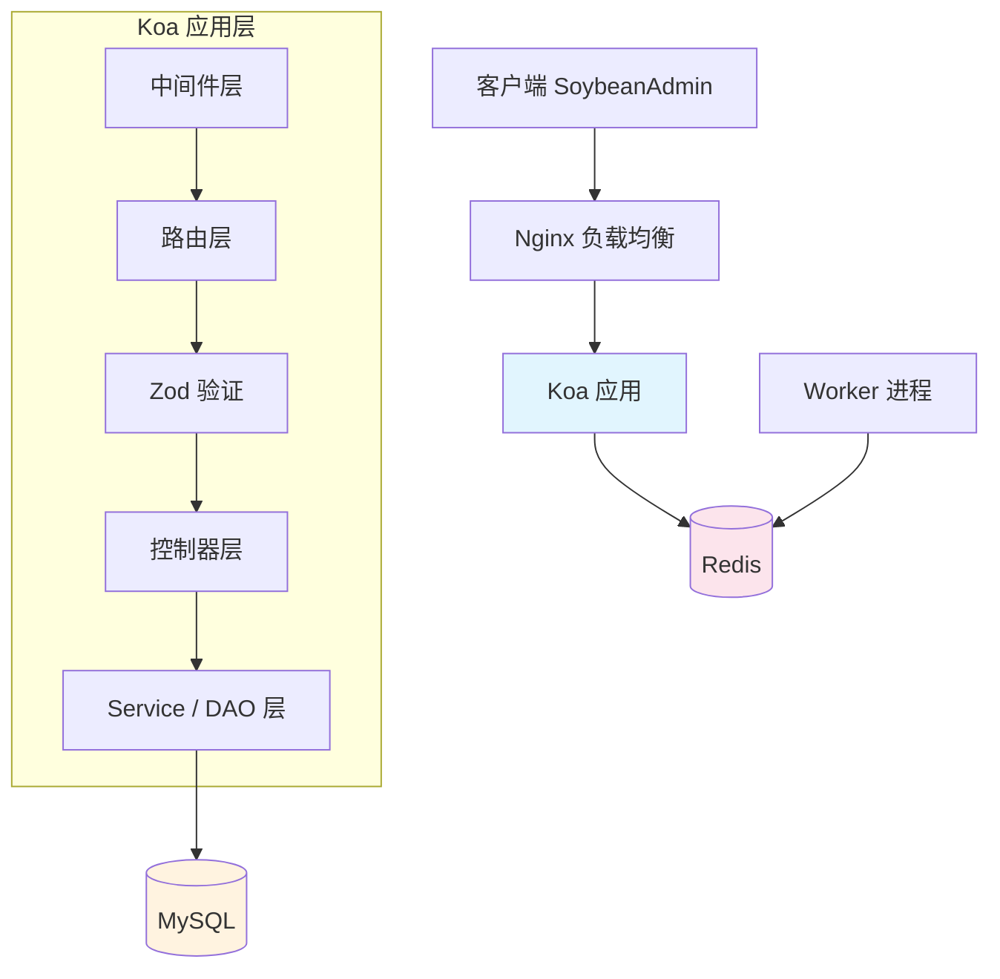
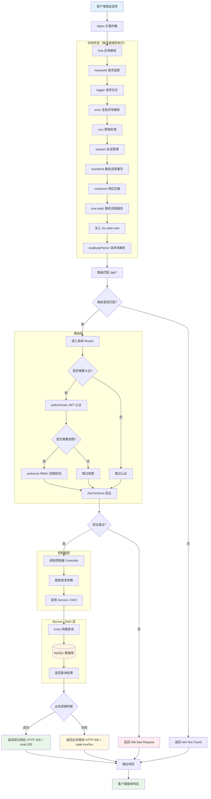
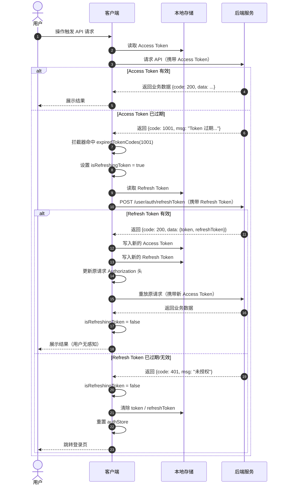
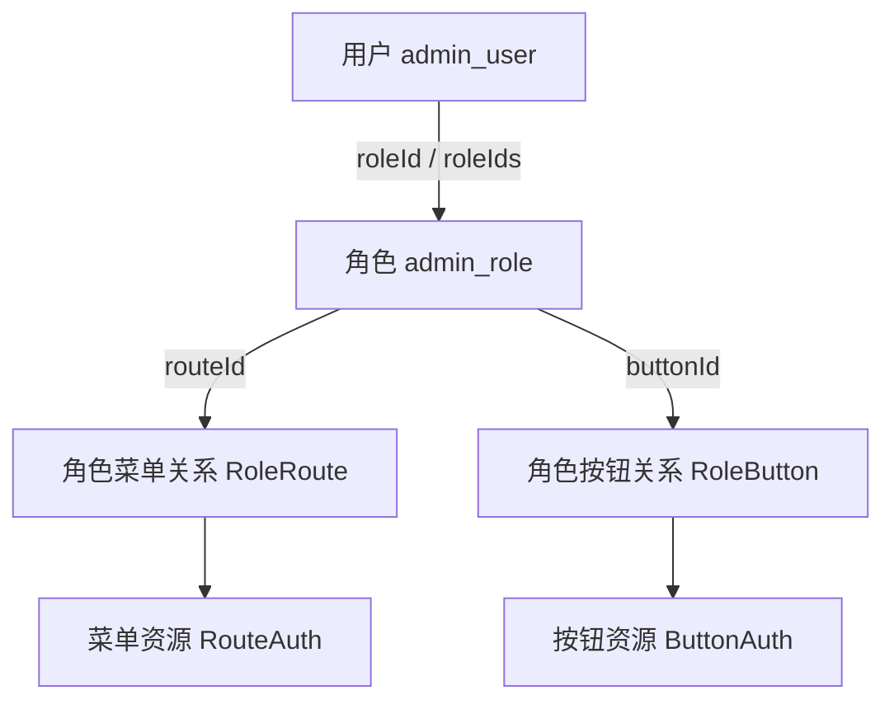
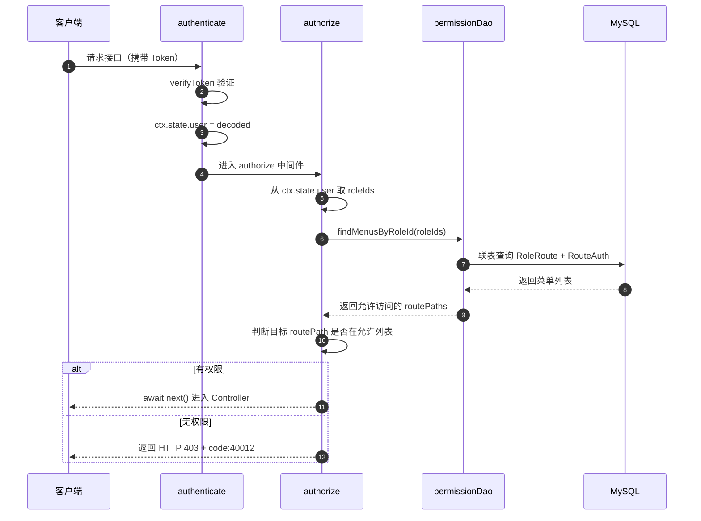
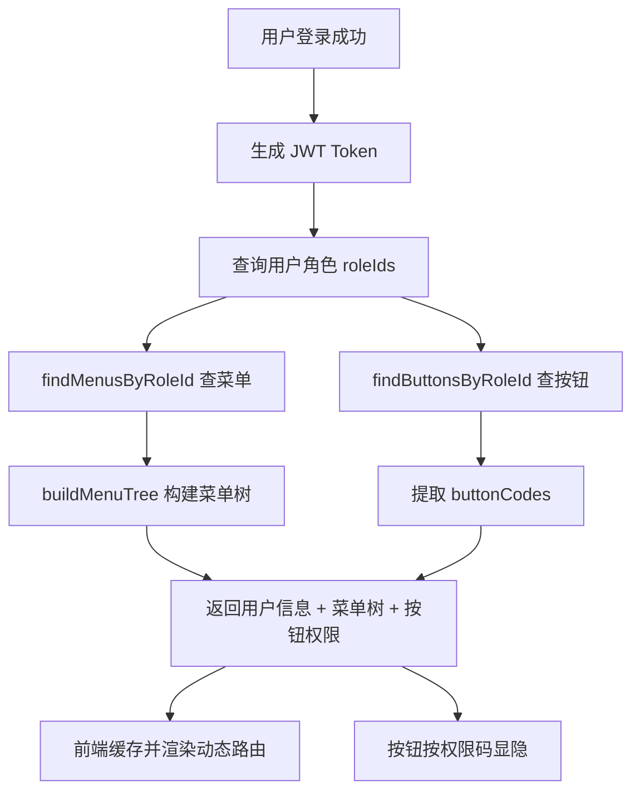

# 项目架构与技术栈说明

## 1. 技术栈概览

| 类别 | 技术 | 版本 | 说明 |
|------|------|------|------|
| **核心框架** | Koa | 3.2.x | 轻量级 Node.js Web 框架 |
| **运行时** | Node.js | 22.x | ES Modules 原生支持 |
| **数据库** | MySQL | 8.x | 关系型数据库 |
| **查询构建器** | Knex.js | 3.x | SQL 查询构建器 |
| **参数校验** | Zod | 4.x | Schema 验证库 |
| **日志系统** | Pino | 10.x | 高性能 JSON 日志 |
| **密码加密** | bcryptjs | 2.x | 密码哈希 |
| **认证** | JWT | 9.x | JSON Web Token (双 Token: Access + Refresh) |
| **权限控制** | RBAC | - | 基于角色的访问控制 |
| **缓存** | Redis | - | 会话缓存 / 限流 / 任务队列 |
| **进程管理** | PM2 | - | 生产环境进程管理 |
| **任务队列** | Bull | 4.x | Redis 任务队列 |

---

## 2. 目录结构

```
src/
├── app.js                 # 应用入口
├── worker.js              # 后台任务 Worker
├── config/                # 配置文件
│   ├── admin.js           # 管理员配置
│   ├── businessCode.js    # 业务状态码
│   ├── cors.js            # 跨域配置
│   ├── database.js        # 数据库连接 (Knex)
│   ├── env.js             # 环境变量加载
│   ├── httpError.js       # HTTP 状态码
│   ├── jwt.js             # JWT 配置 (Token / RefreshToken)
│   ├── koaBodyConfig.js   # 请求体解析配置
│   ├── logger.js          # 日志配置 (Pino)
│   └── server.js          # 服务器配置
├── controllers/           # 控制器层
│   ├── authController.js
│   ├── menuManageController.js
│   ├── roleManageController.js
│   ├── routerController.js
│   ├── userController.js
│   └── userManageController.js
├── db/                    # 数据库脚本
│   └── new-cms.sql        # 数据库初始化 SQL
├── jobs/                  # 后台任务 (Bull Queue)
│   ├── queue.js           # 队列定义
│   ├── scheduler.js       # 定时任务调度
│   └── processors/
│       └── exampleTask.js # 任务处理器示例
├── middleware/            # Koa 中间件
│   ├── authenticate.js    # JWT 认证 (AccessToken)
│   ├── authorize.js       # RBAC 权限校验
│   ├── checkUserInfo.js   # 用户信息检查
│   ├── compress.js        # 响应压缩
│   ├── error.js           # 全局错误处理
│   ├── logger.js          # 请求日志
│   ├── rateLimiter.js     # 限流中间件
│   ├── requestId.js       # 请求 ID 追踪
│   ├── rewriteUrl.js      # 静态资源 URL 重写
│   └── validationMiddleware.js  # Zod 参数校验
├── plugins/               # 插件扩展
│   ├── openapi/
│   │   └── parser.js      # OpenAPI 解析
│   └── swagger.js         # Swagger 文档
├── routers/               # 路由定义
│   ├── index.js           # 路由入口 / 路由注册
│   └── router/
│       ├── authRouter.js      # 认证路由 (登录 / 刷新 Token)
│       ├── menuManageRouter.js
│       ├── roleManageRouter.js
│       ├── routeRouter.js
│       ├── systemManageRouter.js
│       ├── userManageRouter.js
│       └── userRouter.js
├── schemas/               # Zod Schema 定义
│   ├── common/
│   │   └── paramsSchema.js
│   ├── models/
│   │   ├── authSchema.js
│   │   ├── systemManageSchema.js
│   │   └── userSchema.js
│   └── authSchemas.js
├── services/              # 数据访问层 (DAO / Service)
│   ├── authDao.js
│   ├── collectDao.js
│   ├── menuDao.js
│   ├── orderDao.js
│   ├── permissionDao.js
│   ├── productDao.js
│   ├── roleDao.js
│   ├── shoppingCartDao.js
│   ├── userDao.js
│   └── usersDao.js
└── utils/                 # 工具函数
    ├── adminPermission.js # 管理员权限工具
    ├── captcha.js         # 验证码工具
    ├── createResponse.js  # 响应格式化
    ├── db.js              # 数据库工具 (兼容旧代码)
    ├── encrypt.js         # 加密工具
    ├── errorHandler.js    # 错误处理包装器
    ├── jwt.js             # JWT 工具 (生成 / 验证 / 刷新)
    ├── password.js        # 密码加密 (bcryptjs)
    ├── redis.js           # Redis 客户端
    └── validateParams.js  # 参数校验工具
```

---

## 3. 系统架构



---

## 4. 请求处理流程



---

## 5. 技术栈使用指南

### 5.1 Zod 参数验证

**Schema 定义**: `src/schemas/models/userEntitySchema.js`

```javascript
import { z } from 'zod'

// 定义 Schema
export const LoginBodySchema = z.object({
  username: z.string().min(1, '用户名不能为空'),
  password: z.string().min(6, '密码至少6位')
})

// 可选字段
export const UpdateUserSchema = z.object({
  name: z.string().optional(),
  age: z.number().int().positive().optional()
})

// 自定义验证
export const PasswordSchema = z.string()
  .regex(/^[a-zA-Z]\w{5,17}$/, '密码格式不正确')
```

**路由中使用**:

```javascript
import { validateBody, validateQuery } from '../../middleware/validationMiddleware.js'

// POST 请求验证 body
router.post('/login', validateBody(LoginBodySchema), controller.login)

// GET 请求验证 query
router.get('/users', validateQuery(QuerySchema), controller.list)
```

---

### 5.2 密码加密

**工具文件**: `src/utils/password.js`

```javascript
import { hashPassword, comparePassword } from '../utils/password.js'

// 注册时加密
const hashedPassword = await hashPassword('plaintext123')
// 结果: $2a$10$...

// 登录时验证
const isMatch = await comparePassword('plaintext123', hashedPassword)
// 结果: true 或 false
```

---

### 5.3 JWT 双 Token 认证 (AccessToken + RefreshToken)

**工具文件**: `src/utils/jwt.js`

```javascript
import {
  generateToken,
  generateRefreshToken,
  verifyToken,
  verifyRefreshToken
} from '../utils/jwt.js'

// 生成 Access Token（短期有效，默认 15m）
const token = generateToken({ userId: 1, role: 'user' })

// 生成 Refresh Token（长期有效，默认 7d）
const refreshToken = generateRefreshToken({ userId: 1, role: 'user' })

// 验证 Access Token
const decoded = verifyToken(token)

// 验证 Refresh Token（用于无感刷新）
const decodedRefresh = verifyRefreshToken(refreshToken)
```

**认证中间件**:

```javascript
import authenticate from '../../middleware/authenticate.js'
import authorize from '../../middleware/authorize.js'

// 需要认证的路由
router.get('/profile', authenticate, controller.getProfile)

// 需要特定权限的路由
router.delete('/users/:id', authenticate, authorize('user:delete'), controller.deleteUser)
```

**无感刷新流程**:



---

### 5.4 响应格式化

**工具文件**: `src/utils/createResponse.js`

```javascript
import {
  createSuccessResponse,
  createFailResponse,
  createErrorResponse,
  createPaginatedResponse
} from '../utils/createResponse.js'

// 成功响应
ctx.body = createSuccessResponse('操作成功', 200, { user })
// { success: true, message: '操作成功', status: 200, data: { user } }

// 失败响应
ctx.body = createFailResponse('用户不存在', 404)
// { success: false, message: '用户不存在', status: 404 }

// 分页响应
ctx.body = createPaginatedResponse(list, total, page, pageSize)
// { success: true, data: { list, pagination: { total, page, pageSize, totalPages } } }
```

---

### 5.5 日志系统

**配置文件**: `src/config/logger.js`

```javascript
import logger from '../config/logger.js'

// 不同级别
logger.info('用户登录成功')
logger.warn('请求频率过高')
logger.error({ err: error, userId: 1 }, '数据库查询失败')

// 在中间件中使用 ctx.log
ctx.log.info('处理请求中...')
```

---

### 5.6 RBAC 权限校验流程

**参与文件**:
- `src/middleware/authenticate.js` — JWT 认证
- `src/middleware/authorize.js` — 路由权限校验
- `src/services/permissionDao.js` — 权限数据查询
- `src/utils/adminPermission.js` — 菜单树构建

**权限模型**:



**接口鉴权流程**:



**登录后权限加载流程**:



**路由层使用示例**:

```javascript
import authenticate from '../../middleware/authenticate.js'
import authorize from '../../middleware/authorize.js'

// 仅需登录
router.get('/user/getUserInfo', authenticate, controller.getUserInfo)

// 登录 + 菜单权限校验
router.get(
  '/system/users',
  authenticate,
  authorize('/system/users'),
  controller.listUsers
)
```

---

### 5.7 后台任务 (Bull Queue)

**队列定义**: `src/jobs/queue.js`

```javascript
import { cronQueue } from './jobs/queue.js'

// 添加任务
await cronQueue.add('taskName', { data: 'value' }, {
  delay: 5000,           // 延迟 5 秒
  attempts: 3,           // 重试 3 次
  removeOnComplete: true // 完成后删除
})

// 定时任务
await cronQueue.add('dailyReport', {}, {
  repeat: { cron: '0 9 * * *' }  // 每天 9 点
})
```

**任务处理器**: `src/jobs/processors/exampleTask.js`

```javascript
export default async function (job) {
  console.log('处理任务:', job.data)
  // 业务逻辑
  return { success: true }
}
```

---

## 6. 业务状态码

**文件**: `src/config/businessCode.js`

| 状态码 | 常量 | 说明 |
|--------|------|------|
| 200 | businessCode.success | 操作成功 |
| 500 | businessCode.error | 操作失败 |
| 400 | businessCode.paramError | 参数错误 |
| 401 | businessCode.unAuthorized | 未授权 / Refresh Token 过期 |
| 1001 | businessCode.tokenExpired | Access Token 过期（触发前端无感刷新） |
| 40001 | businessCode.userParamMissing | 用户名或密码为空 |
| 40002 | businessCode.userNameInvalid | 用户名格式错误 |
| 40003 | businessCode.passwordInvalid | 密码格式错误 |
| 40004 | businessCode.userNotFound | 用户不存在 |
| 40005 | businessCode.userExist | 用户已存在 |
| 40006 | businessCode.userLoginFail | 登录失败 |
| 40010 | businessCode.adminUserDisabled | 账号已被禁用 |
| 40011 | businessCode.roleNotFound | 角色不存在 |
| 40012 | businessCode.permissionDenied | 权限不足 |

**消息映射对象**: `businessMsg`（key 为状态码）

### 6.1 HTTP 状态码

**文件**: `src/config/httpError.js`

| HTTP 状态码 | 常量 | 说明 |
|--------|------|------|
| 200 | httpCode.ok | 成功 |
| 400 | httpCode.badRequest | 请求参数错误 |
| 401 | httpCode.unauthorized | 未授权 |
| 403 | httpCode.forbidden | 禁止访问 |
| 404 | httpCode.notFound | 资源不存在 |
| 500 | httpCode.internalServerError | 服务器内部错误 |

**消息映射对象**: `httpMessage`（key 为状态码）

---

## 7. 环境配置

**配置文件**: `.env.development` / `.env.production` / `.env.test`

```bash
# 服务器
PORT=8080

# 数据库
DB_HOST=localhost
DB_USER=root
DB_PASSWORD=your_password
DB_NAME=your_database

# Redis
REDIS_HOST=127.0.0.1
REDIS_PORT=6379
REDIS_PASSWORD=
REDIS_DB=0

# JWT 双 Token 配置
JWT_SECRET=your_jwt_secret
JWT_EXPIRES_IN=15m              # Access Token 过期时间
JWT_REFRESH_EXPIRES_IN=7d       # Refresh Token 过期时间
```

---

## 8. 开发命令

```bash
# 开发模式
npm run dev
npm run dev:win

# 后台 Worker
npm run worker:dev

# 代码检查
npm run lint
npm run lint:fix

# 构建
npm run build

# 部署
npm run deploy:test
npm run deploy:prod

# 生成 API 文档
npm run docs
npm run docs:serve
```

PM2 使用细节可参考：`docs/PM2_GUIDE.md`

---

## 9. 添加新功能指南

### 添加新的 API 端点

1. **创建 Schema** - `src/schemas/models/xxxSchema.js`
2. **创建 DAO** - `src/models/dao/xxxDao.js`
3. **创建 Controller** - `src/controllers/xxx/xxxController.js`
4. **创建 Router** - `src/routers/router/xxxRouter.js`
5. **注册路由** - 在 `src/routers/index.js` 中引入

### 示例：添加文章模块

```javascript
// 1. Schema: src/schemas/models/articleSchema.js
import { z } from 'zod'

export const CreateArticleSchema = z.object({
  title: z.string().min(1).max(100),
  content: z.string().min(1)
})

// 2. Service / DAO: src/services/articleDao.js
import { db } from '../config/database.js'

const create = async (data) => {
  const [id] = await db('articles').insert(data)
  return { id }
}

export default { create }

// 3. Controller: src/controllers/articleController.js
import articleDao from '../services/articleDao.js'
import { createSuccessResponse } from '../utils/createResponse.js'

const create = async (ctx) => {
  const data = ctx.request.body
  const result = await articleDao.create(data)
  ctx.body = createSuccessResponse('创建成功', 200, result)
}

export default { create }

// 4. Router: src/routers/router/articleRouter.js
import Router from '@koa/router'
import articleController from '../../controllers/articleController.js'
import { validateBody } from '../../middleware/validationMiddleware.js'
import { errorControllerWrapper } from '../../utils/errorHandler.js'
import { CreateArticleSchema } from '../../schemas/models/articleSchema.js'

const router = new Router({ prefix: '/articles' })

router.post(
  '/',
  validateBody(CreateArticleSchema),
  errorControllerWrapper(articleController.create)
)

export default router

// 5. 注册路由: src/routers/index.js
import articleRouter from './router/articleRouter.js'

export default function (app) {
  app.use(articleRouter.routes()).use(articleRouter.allowedMethods())
}
```
