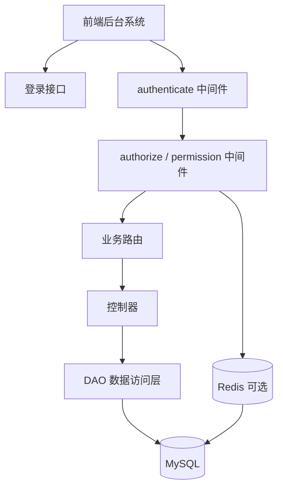
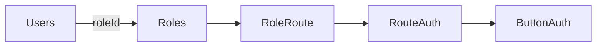
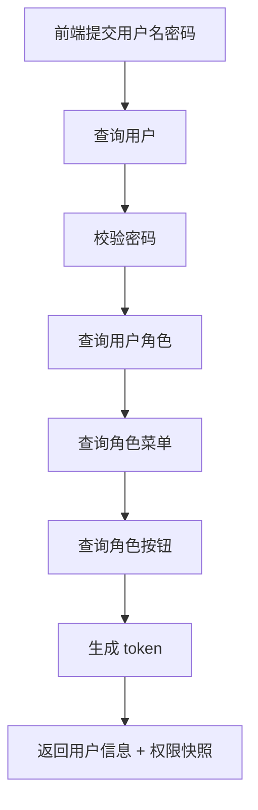
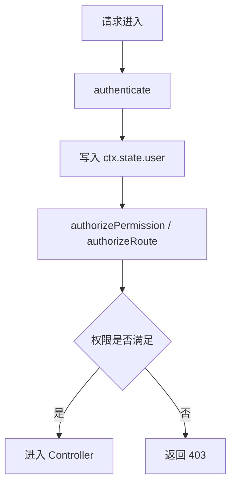
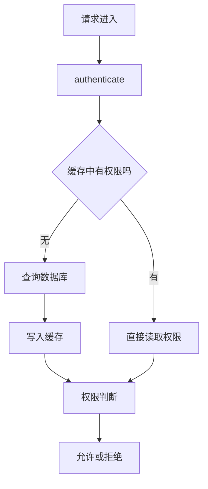
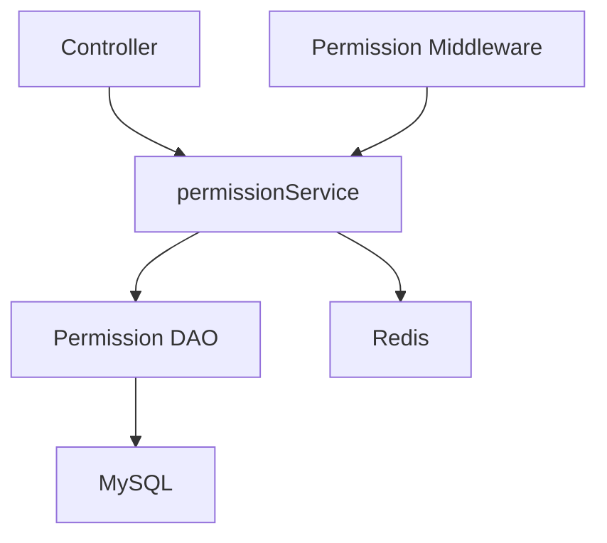
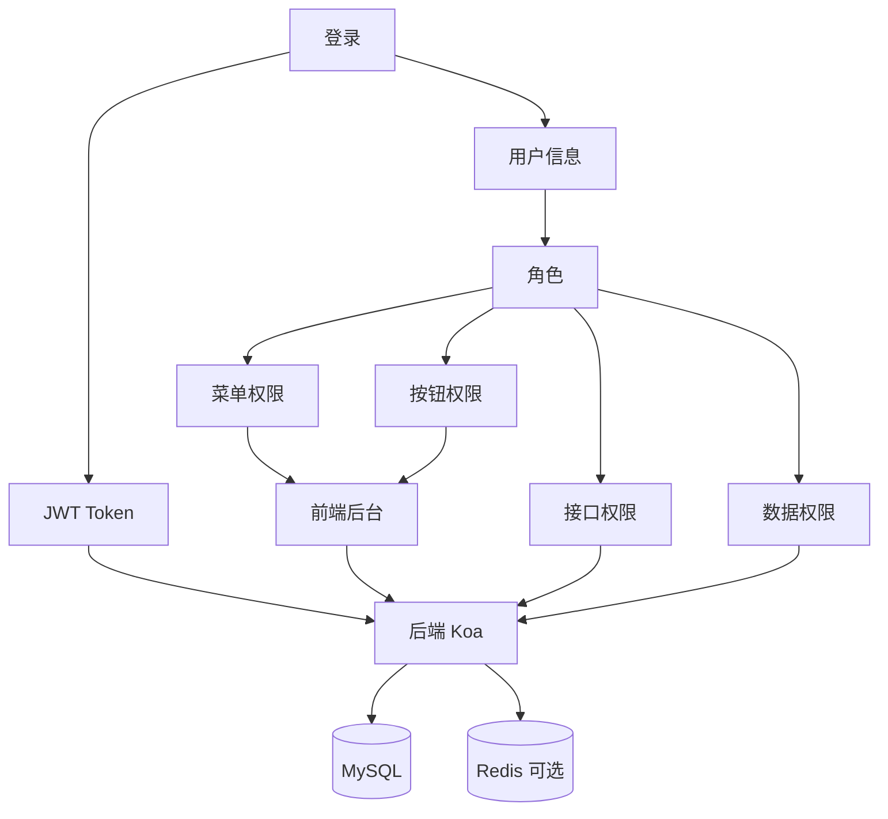

# Koa 项目 RBAC 落地实现方案

这份文档面向你当前这个 `Koa` 项目，目标不是只讲 RBAC 理论，而是讲清楚：

- 在 Koa 项目里如何真正把 RBAC 做出来
- 现有项目代码结构应该怎么接入
- 登录、鉴权、菜单、按钮、接口权限怎么串起来
- 数据库、路由、中间件、缓存分别放在哪一层

这份方案会尽量贴合你当前项目已有实现：

- `authenticate.js`
- `authorize.js`
- `adminAuthDao.js`
- `adminPermissionDao.js`
- `adminManageRouter.js`
- `authController.js`

---

## 1. 方案目标

一个完整的 Koa RBAC 落地方案，至少要满足下面这些目标：

- 后台用户登录后能拿到自己的角色和权限
- 前端能根据权限渲染菜单
- 前端能根据权限控制按钮显示
- 后端能根据权限控制接口访问
- 后续可继续扩展数据权限
- 支持角色变更后快速生效

如果只做“前端菜单显隐”，而后端接口不做权限校验，这不算真正落地。

真正落地的关键是：

- 前端做展示控制
- 后端做最终访问控制

---

## 2. 当前项目现状

你当前项目已经有一部分 RBAC 基础能力：

### 2.1 已有能力

- JWT 登录鉴权：`src/middleware/authenticate.js`
- 路由级权限判断：`src/middleware/authorize.js`
- 后台登录接口：`src/controllers/authController.js`
- 角色菜单查询：`src/models/dao/adminPermissionDao.js`
- 管理接口已接入部分权限校验：`src/routers/router/adminManageRouter.js`

### 2.2 当前权限数据结构

- `Users`
- `Roles`
- `RouteAuth`
- `RoleRoute`
- `ButtonAuth`

### 2.3 当前模型本质

当前更接近：

```text
用户 -> 单角色 -> 菜单权限 + 按钮权限
```

### 2.4 当前不足

- 用户默认只有一个角色
- 接口权限尚未统一资源化
- 按钮权限和菜单权限还没有统一权限码
- 数据权限还未纳入模型

所以这份方案会给出：

- 当前结构下可直接落地的做法
- 后续演进到完整 RBAC 的路线

---

## 3. 落地总体架构图



说明：

- 登录接口负责签发 token 和返回权限信息
- `authenticate` 只负责“你是谁”
- `authorize` 负责“你能做什么”
- DAO 负责从数据库中查角色与权限
- Redis 可以作为权限缓存层

---

## 4. 推荐分层职责

在 Koa 项目里，建议这样拆职责：

### 4.1 `controllers`

负责：

- 接收参数
- 组织业务流程
- 返回响应

不负责：

- 直接写复杂权限 SQL

### 4.2 `models/dao`

负责：

- 用户、角色、菜单、权限相关 SQL

### 4.3 `middleware/authenticate.js`

负责：

- 解析 token
- 验证 token
- 将登录用户写入 `ctx.state.user`

### 4.4 `middleware/authorize.js`

负责：

- 判断当前用户是否拥有目标权限
- 权限不足时返回 `403`

### 4.5 `routers`

负责：

- 把 `authenticate + authorize` 正式接到业务接口上

---

## 5. 建议的目录结构

在当前项目基础上，推荐最终整理成这样：

```text
src/
├── controllers/
│   ├── admin/
│   │   ├── authController.js
│   │   ├── userManageController.js
│   │   ├── roleManageController.js
│   │   └── menuManageController.js
├── middleware/
│   ├── authenticate.js
│   ├── authorize.js
│   └── permission.js
├── models/
│   └── dao/
│       ├── adminAuthDao.js
│       ├── adminPermissionDao.js
│       ├── adminUserDao.js
│       ├── adminRoleDao.js
│       └── adminMenuDao.js
├── routers/
│   └── router/
│       ├── adminRouter.js
│       └── adminManageRouter.js
├── utils/
│   ├── jwt.js
│   └── adminPermission.js
└── config/
    ├── jwt.js
    └── businessCode.js
```

如果后面权限继续变复杂，可以再加：

```text
src/services/
└── permissionService.js
```

把权限聚合逻辑从 controller 中抽出去。

---

## 6. 数据库落地方案

### 6.1 当前项目兼容方案

直接使用已有表：

- `Users`
- `Roles`
- `RouteAuth`
- `RoleRoute`
- `ButtonAuth`

这套结构足够支撑：

- 登录
- 菜单权限
- 按钮权限
- 路由级接口权限

### 6.2 当前关系图



### 6.3 推荐演进方案

后续建议增加：

- `UserRole`
- `Permission`
- `RolePermission`

形成更标准的 RBAC：

```text
User -> UserRole -> Role -> RolePermission -> Permission
```

---

## 7. 登录流程落地方案

### 7.1 登录目标

登录成功后，后端应返回：

- `token`
- 当前用户信息
- 菜单树
- 按钮权限
- 权限码列表

### 7.2 当前项目已有实现

你当前的 `authController.js` 已经在做这件事：

- 登录校验账号密码
- 查询角色菜单和按钮
- 生成 token
- 返回权限快照

### 7.3 推荐返回结构

```json
{
  "code": 0,
  "msg": "登录成功",
  "data": {
    "token": "xxx",
    "user": {
      "id": 1,
      "username": "admin",
      "roleId": 1,
      "roleName": "admin"
    },
    "menus": [],
    "buttons": [],
    "permissions": {
      "routePaths": [],
      "routeNames": [],
      "buttons": []
    }
  }
}
```

### 7.4 登录流程图



---

## 8. Token 鉴权落地方案

### 8.1 `authenticate` 的职责

你的 `authenticate.js` 应只负责：

- 从请求头取 `Authorization`
- 校验 `Bearer token`
- 解码 token
- 把用户信息注入 `ctx.state.user`

### 8.2 token 中建议放什么

推荐只放轻量、稳定的信息：

```json
{
  "userId": 1,
  "username": "admin",
  "roleId": 1,
  "roleName": "admin"
}
```

不建议把完整权限列表塞进 token：

- token 会变大
- 权限变更后不容易立即生效

更好的方式是：

- token 放身份信息
- 权限运行时查询或缓存读取

---

## 9. 权限校验落地方案

权限校验建议分两层：

### 9.1 菜单/按钮展示层

前端根据登录返回的权限快照做：

- 动态菜单渲染
- 按钮显隐

### 9.2 接口访问层

后端中间件根据角色权限做：

- 接口访问拦截

后端必须是最终权限判断者。

---

## 10. 当前项目路由级权限做法

你当前的 `authorizeRoute('/system/accountManage')` 这种用法，其实已经是一个可工作的落地方案。

例如：

```js
const useAccountManagePermission = [authenticate, authorizeRoute('/system/accountManage')]
```

说明：

- 先鉴权
- 再判断当前角色是否有对应菜单路径权限

这种方案适合：

- 后台基础权限控制
- 菜单页级别的访问控制

但它还有提升空间。

---

## 11. 推荐的接口权限落地方式

与其只按“菜单路径”校验，长期更推荐按“权限码”校验。

例如：

```text
system:user:list
system:user:create
system:user:update
system:user:delete
```

然后新增统一中间件：

```js
authorizePermission('system:user:list')
```

这样比 `authorizeRoute('/system/accountManage')` 更细粒度。

---

## 12. 推荐中间件结构

### 12.1 登录鉴权中间件

```js
authenticate
```

### 12.2 菜单级权限中间件

```js
authorizeRoute('/system/accountManage')
```

### 12.3 按权限码校验的中间件

推荐新增：

```js
authorizePermission('system:user:create')
```

### 12.4 数据权限中间件

后续可新增：

```js
withDataScope('user:list')
```

---

## 13. 推荐权限中间件流程图



---

## 14. 菜单权限落地

### 14.1 菜单权限的职责

菜单权限主要解决：

- 左侧菜单显示哪些项
- 用户能否进入某个功能页

### 14.2 当前项目的做法

你当前项目是通过：

- `RoleRoute`
- `RouteAuth`

查询某个角色拥有的菜单。

### 14.3 推荐输出形式

后端返回：

- 平铺列表
- 树形结构

因为：

- 前端动态路由需要树
- 权限管理页面常常需要平铺列表

---

## 15. 按钮权限落地

### 15.1 按钮权限的职责

按钮权限主要控制：

- 新增按钮显示
- 编辑按钮显示
- 删除按钮显示
- 导出按钮显示

### 15.2 推荐做法

登录后返回：

```json
{
  "buttons": ["user:add", "user:edit", "user:delete"]
}
```

前端判断：

```js
if (buttons.includes('user:delete')) {
  // 显示删除按钮
}
```

### 15.3 后端是否也要校验

要。

因为前端隐藏按钮只是体验优化，不是安全控制。

---

## 16. 接口权限落地

接口权限是 RBAC 真正落地的关键。

推荐做法：

- 每个核心接口绑定一个权限码
- 中间件校验权限码

例如：

```js
router.post(
  '/system/users',
  authenticate,
  authorizePermission('system:user:create'),
  controller
)
```

---

## 17. 数据权限落地

如果后续你要做更完整后台，建议把“数据权限”独立出来。

例如：

- 超级管理员看全部
- 部门管理员看本部门
- 普通员工只看自己

后端查询时自动拼条件：

```sql
WHERE created_by = currentUserId
```

或者：

```sql
WHERE dept_id IN (...)
```

这个能力不建议混在菜单权限里。

---

## 18. Koa 中推荐的权限缓存方案

为了避免每次请求都查数据库，可以加权限缓存。

### 18.1 缓存粒度

推荐按用户或角色缓存：

- `role_permissions:${roleId}`
- `user_permissions:${userId}`

### 18.2 缓存内容

可以缓存：

- 菜单列表
- 按钮列表
- 权限码列表

### 18.3 缓存更新时机

当这些数据变更时需要清缓存：

- 角色菜单被更新
- 角色按钮被更新
- 用户角色被修改

---

## 19. 权限缓存流程图



---

## 20. 推荐的权限服务层

当权限逻辑越来越复杂时，建议新增一个服务层：

```text
src/services/permissionService.js
```

它负责：

- 查询用户角色
- 查询菜单权限
- 查询按钮权限
- 查询接口权限
- 构建菜单树
- 管理缓存

这样 controller 和 middleware 会更轻。

---

## 21. 推荐的权限服务职责图



---

## 22. 现有项目最小可行落地方案

如果你不想大改，现在这套项目可以先这样落地：

### 22.1 保持现有表不动

继续使用：

- `Users`
- `Roles`
- `RouteAuth`
- `RoleRoute`
- `ButtonAuth`

### 22.2 登录时返回权限快照

保留现在 `authController.js` 的设计：

- token
- user
- menus
- buttons
- permissions

### 22.3 所有后台接口接入两层中间件

```js
authenticate
authorizeRoute('/system/accountManage')
```

### 22.4 关键按钮操作再补按钮级权限码

例如：

- 创建用户
- 删除角色
- 删除菜单

---

## 23. 推荐的进阶落地方案

如果你准备把 RBAC 真正做完整，建议按以下步骤逐步升级：

### 第一步：统一权限码

先把所有权限都定义编码：

```text
system:user:list
system:user:create
system:user:update
system:user:delete
system:role:list
system:role:create
...
```

### 第二步：接口中间件切换到权限码

从：

```js
authorizeRoute('/system/accountManage')
```

逐步升级为：

```js
authorizePermission('system:user:list')
```

### 第三步：用户角色改多对多

增加 `UserRole` 表。

### 第四步：统一菜单/按钮/API 到权限资源模型

增加：

- `Permission`
- `RolePermission`

### 第五步：加入数据权限

按角色限制查询范围。

---

## 24. 推荐的接口接入规范

建议每一类后台接口都遵守统一模式：

```js
router.get(
  '/system/users',
  authenticate,
  authorizePermission('system:user:list'),
  validateQuery(...),
  errorControllerWrapper(...)
)
```

统一规范的好处：

- 读代码容易
- 后续审计容易
- 团队协作统一

---

## 25. 推荐的权限码命名规范

建议统一使用：

```text
模块:资源:动作
```

例如：

```text
system:user:list
system:user:create
system:user:update
system:user:delete

system:role:list
system:role:create
system:role:update
system:role:delete

system:menu:list
system:menu:create
system:menu:update
system:menu:delete
```

这种命名最适合：

- 后端中间件校验
- 前端按钮显隐
- 文档整理
- 日志审计

---

## 26. 推荐的开发顺序

如果你现在要在这个项目里一步步做 RBAC，推荐按这个顺序推进：

1. 先把登录与 token 做稳定
2. 再把菜单权限查全并返回前端
3. 再把后端接口都接上 `authenticate`
4. 再把核心管理接口接上 `authorize`
5. 再补按钮权限码
6. 最后再做数据权限和缓存

这样可以最快拿到一个“能用”的后台权限系统。

---

## 27. 当前项目的建议改造清单

建议你接下来按下面的清单推进：

### 27.1 短期

- 保持当前 `authenticate`
- 保持当前 `authorizeRoute`
- 完善按钮权限返回
- 前端按按钮权限控制操作入口

### 27.2 中期

- 新增 `authorizePermission`
- 给所有后台接口绑定权限码
- 引入 Redis 缓存角色权限

### 27.3 长期

- 用户多角色
- 统一权限资源表
- 数据权限范围
- 操作日志 + 权限变更审计

---

## 28. 完整落地方案总图



---

## 29. 小结

Koa 项目里 RBAC 真正落地的关键，不是“有角色表就算完成”，而是要同时打通这几层：

- 登录身份认证
- 菜单权限加载
- 按钮权限控制
- 接口权限校验
- 数据权限过滤
- 缓存与变更同步

对你当前项目来说，最现实的落地路线是：

```text
现有菜单权限方案先跑通
-> 接口统一鉴权
-> 按钮权限补全
-> 权限码统一
-> 数据权限扩展
```

如果你愿意，我下一步可以继续直接帮你补其中任意一份：

- `RBAC 完整建表 SQL`
- `RBAC 权限初始化种子数据`
- `Koa 项目 authorizePermission 中间件实现方案`
