# 完整详细 RBAC 权限模型设计图

这份文档面向后台管理系统，目标是把 `RBAC` 权限模型讲清楚，并给出一套可以直接落地到你当前项目里的设计图和设计方案。

文档重点包括：

- 什么是 RBAC
- 用户、角色、权限之间是什么关系
- 菜单权限、按钮权限、接口权限如何统一设计
- 后台项目中的数据库表应该怎么拆
- 登录后权限是如何加载的
- 如何把 RBAC 落地到当前 Koa 项目

---

## 1. 什么是 RBAC

`RBAC` 全称是 `Role-Based Access Control`，即基于角色的访问控制。

核心思想不是：

- 直接给用户分配大量权限

而是：

- 用户先绑定角色
- 角色再绑定权限
- 用户通过角色继承权限

也就是：

```text
用户 -> 角色 -> 权限
```

这样设计的好处：

- 权限结构清晰
- 便于维护
- 用户数量多时更容易管理
- 角色变更时不需要逐个改用户权限

---

## 2. RBAC 核心对象

一个完整的后台 RBAC 一般至少包括这 5 类对象：

- 用户 `User`
- 角色 `Role`
- 权限资源 `Permission`
- 用户角色关系 `UserRole`
- 角色权限关系 `RolePermission`

权限资源又可以继续细分为：

- 菜单权限
- 按钮权限
- 接口权限
- 数据权限

---

## 3. RBAC 核心关系图

下面是最基础的一张 RBAC 结构图：

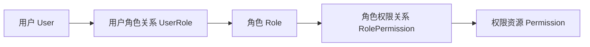

这张图表达的是：

- 一个用户可以拥有多个角色
- 一个角色可以分配多个权限
- 一个权限也可以被多个角色复用

所以本质上是两个多对多关系：

- 用户和角色：多对多
- 角色和权限：多对多

---

## 4. 后台系统更完整的 RBAC 设计图

后台管理项目里，权限通常不止一种，所以更完整的模型可以画成这样：

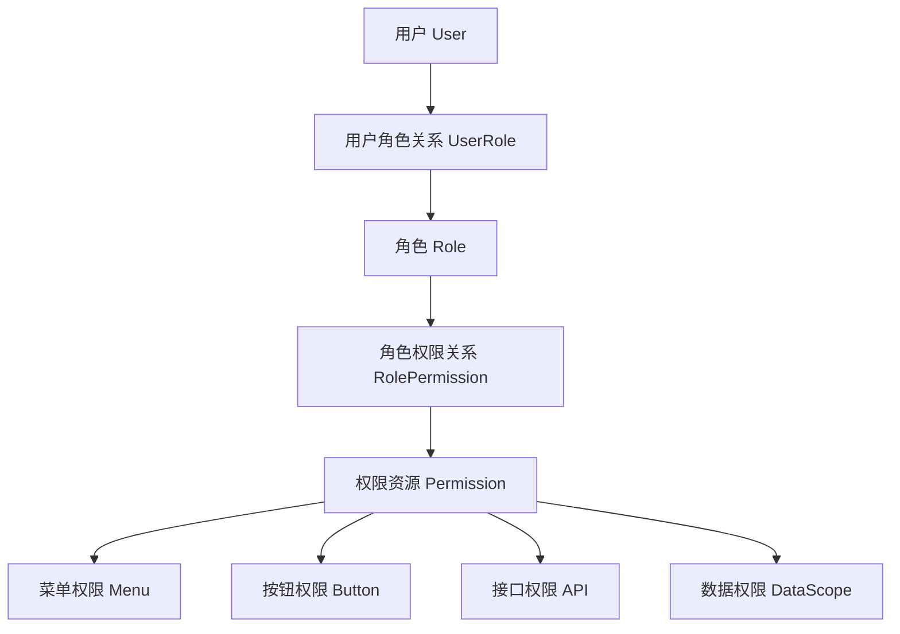

这里的思路是：

- `Permission` 是统一权限资源抽象层
- 菜单、按钮、接口、数据权限都是权限资源的一种表现

如果你的系统比较简单，也可以不做统一抽象，直接拆成：

- 角色菜单关系
- 角色按钮关系
- 角色接口关系

但从长期维护看，统一抽象会更优雅。

---

## 5. 后台管理常见权限层次

一个完整后台通常至少有 4 层权限：

### 5.1 登录权限

是否允许登录后台。

### 5.2 菜单权限

控制左侧菜单是否显示，例如：

- 系统管理
- 用户管理
- 角色管理
- 菜单管理

### 5.3 按钮权限

控制页面按钮是否可见，例如：

- 新增
- 编辑
- 删除
- 导出
- 审核

### 5.4 接口权限

控制接口是否可调用，例如：

- `GET /api/system/users`
- `POST /api/system/users`
- `DELETE /api/system/menus`

实际项目里，推荐后端必须做接口权限校验，不能只依赖前端菜单显隐。

---

## 6. 权限分层设计图

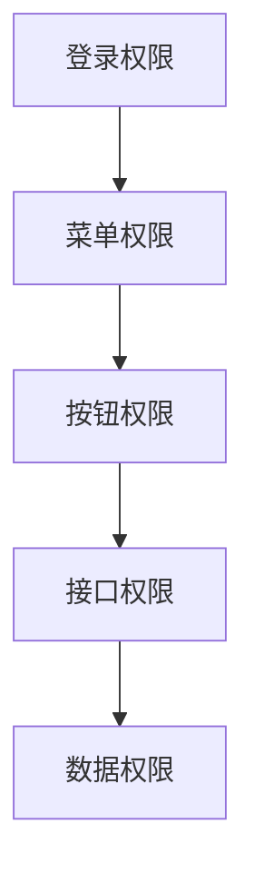

说明：

- 登录成功只是第一步
- 能看到菜单，不代表能操作按钮
- 能点按钮，不代表一定能访问接口
- 能访问接口，也不代表能看到全部数据

这是后台权限设计里非常重要的一点。

---

## 7. RBAC 典型数据库关系图

推荐的标准关系如下：

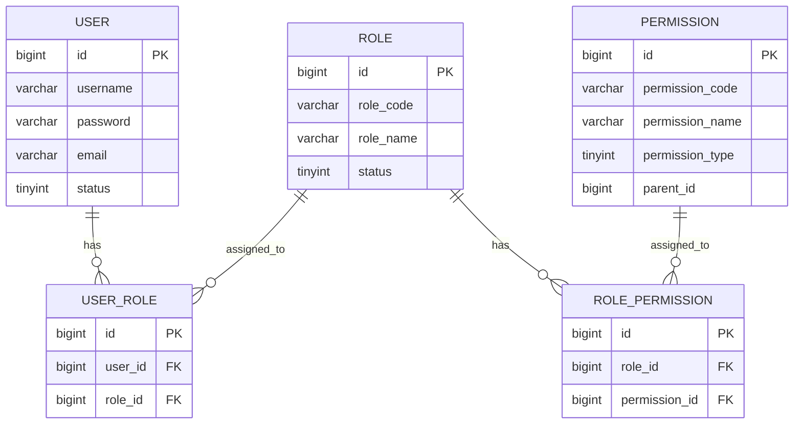

这个 ER 图适合做标准 RBAC。

---

## 8. 面向后台管理的推荐表设计

推荐至少有这几张表：

### 8.1 用户表

`admin_user`

### 8.2 角色表

`admin_role`

### 8.3 权限资源表

`admin_permission`

### 8.4 用户角色关系表

`admin_user_role`

### 8.5 角色权限关系表

`admin_role_permission`

如果需要更细分，还可以拆：

- `admin_menu`
- `admin_button_permission`
- `admin_api_permission`

但更推荐统一成一张资源表，通过 `permission_type` 区分。

---

## 9. 权限资源统一模型

推荐在一张 `permission` 表中统一存：

- 目录
- 菜单
- 按钮
- 接口

例如：

| 字段 | 说明 |
| --- | --- |
| `id` | 主键 |
| `parent_id` | 父级资源 ID |
| `permission_code` | 权限编码 |
| `permission_name` | 权限名称 |
| `permission_type` | 资源类型 |
| `path` | 菜单路由或接口路径 |
| `method` | 接口方法 |
| `component` | 前端组件 |
| `icon` | 菜单图标 |
| `sort` | 排序 |
| `status` | 状态 |

其中 `permission_type` 可以约定：

- `1` 目录
- `2` 菜单
- `3` 按钮
- `4` 接口

这样菜单、按钮、接口都能统一管理。

---

## 10. RBAC 数据库设计图

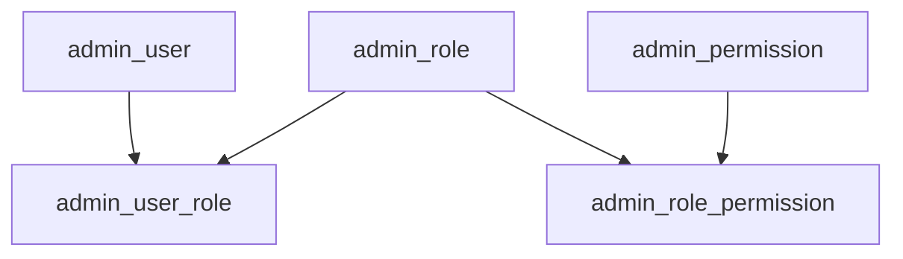

如果你要更贴合“菜单管理页面”的后台场景，也可以扩展为：

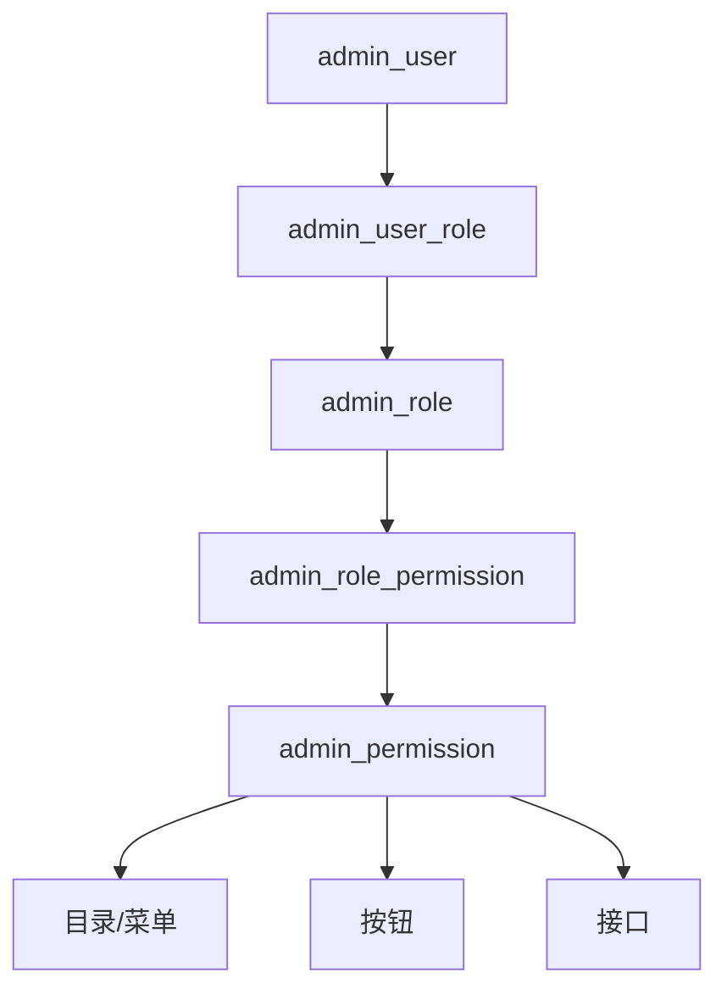

---

## 11. 当前项目结构与 RBAC 的映射关系

你当前项目里已经存在一套接近 RBAC 的结构：

- `Users`
- `Roles`
- `RouteAuth`
- `RoleRoute`
- `ButtonAuth`

它可以映射成：

| 当前表 | RBAC 角色 |
| --- | --- |
| `Users` | 用户 |
| `Roles` | 角色 |
| `RouteAuth` | 菜单权限资源 |
| `RoleRoute` | 角色菜单关系 |
| `ButtonAuth` | 按钮权限资源 |

所以当前项目已经实现了“弱化版 RBAC”：

```text
用户 -> 角色 -> 菜单/按钮权限
```

如果继续演进，建议补上：

- 用户角色多对多关系
- 统一权限资源表
- 接口权限码
- 数据权限范围

---

## 12. 当前项目的 RBAC 关系图

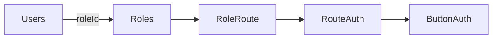

这张图对应的是你当前已有结构。

问题在于：

- 一个用户当前只支持一个角色
- 按钮权限是挂在菜单上的，不够统一
- 接口权限没有完全资源化

所以它能用，但不是最完整的 RBAC。

---

## 13. 标准 RBAC 与当前项目对比

### 13.1 当前项目方案

优点：

- 简单
- 易理解
- 已经能支撑后台基础权限

缺点：

- 扩展性一般
- 用户多角色支持弱
- 接口权限和数据权限不完整

### 13.2 标准 RBAC 方案

优点：

- 扩展性更强
- 权限模型统一
- 更适合大型后台系统

缺点：

- 表更多
- 学习成本更高

建议：

- 当前项目继续沿用现有结构可以
- 新功能逐步向标准 RBAC 演进更合理

---

## 14. 登录后的 RBAC 授权流程图

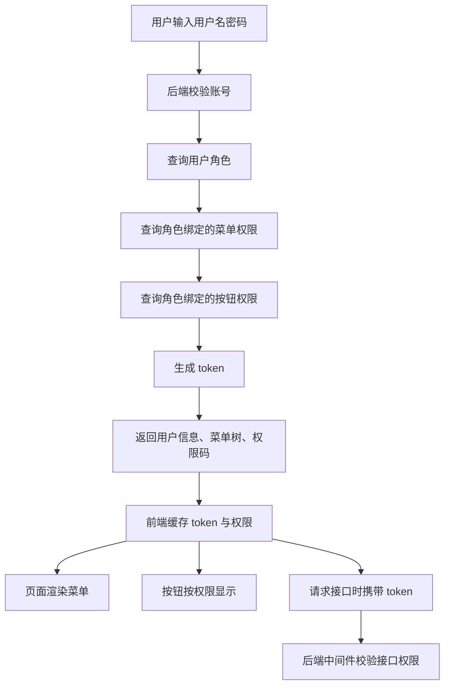

这就是后台项目最常见的权限加载链路。

---

## 15. 接口鉴权流程图

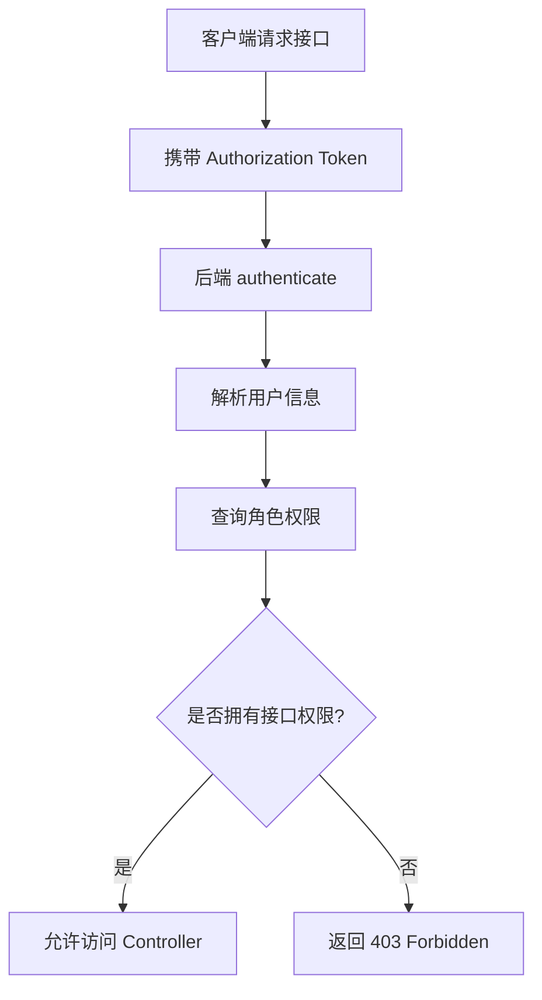

这张图对应的就是后端真正的接口保护逻辑。

---

## 16. 菜单权限、按钮权限、接口权限关系图

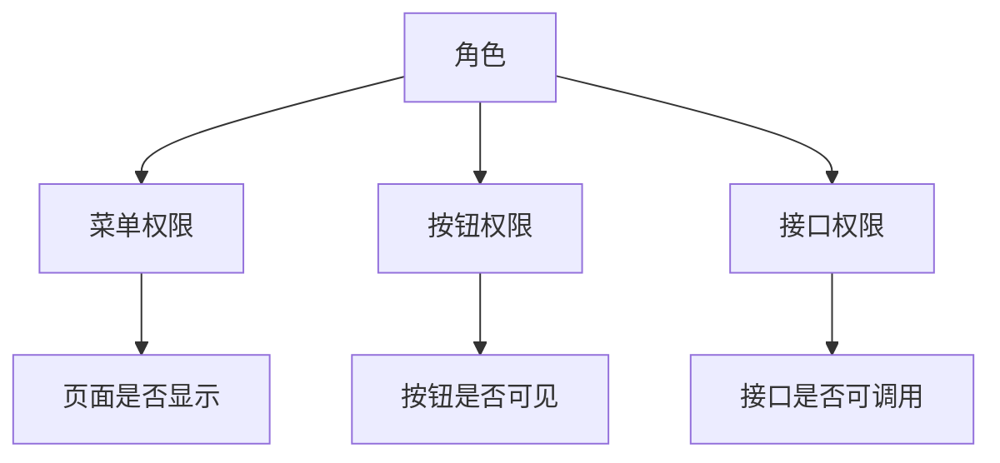

注意：

- 菜单权限解决“看不看得到”
- 按钮权限解决“点不点得了”
- 接口权限解决“调不调用得了”

后端安全必须落在“接口权限”上。

---

## 17. 数据权限模型

很多后台除了功能权限，还会有数据权限。

例如：

- 超级管理员：看全部数据
- 部门管理员：只看本部门
- 普通员工：只看自己创建的数据

这时可以给角色再绑定一个“数据范围”。

推荐设计：

| 数据范围值 | 说明 |
| --- | --- |
| `ALL` | 全部数据 |
| `DEPT` | 本部门数据 |
| `DEPT_AND_CHILD` | 本部门及子部门 |
| `SELF` | 仅本人数据 |
| `CUSTOM` | 自定义数据范围 |

---

## 18. 数据权限设计图

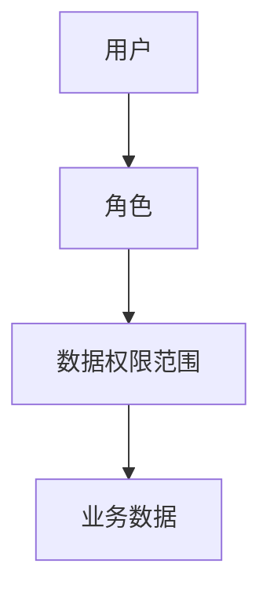

接口层实现时，一般会在查询条件里自动加限制，例如：

- 只查当前用户创建的数据
- 只查当前部门的数据

---

## 19. 超级管理员如何设计

最常见做法有两种：

### 19.1 方案一：固定超级管理员角色

例如：

- `role_code = super_admin`

特点：

- 简单
- 易维护

### 19.2 方案二：逻辑绕过权限判断

例如：

- 用户是系统初始管理员时，默认拥有全部权限

建议：

- 优先使用“超级管理员角色”
- 不要在代码里散落大量特殊判断

---

## 20. RBAC 权限编码规范

权限码建议统一命名，例如：

```text
system:user:list
system:user:create
system:user:update
system:user:delete

system:role:list
system:role:create
system:role:update
system:role:delete

system:menu:list
system:menu:create
system:menu:update
system:menu:delete
```

按钮权限和接口权限都可以复用这套编码。

优点：

- 命名统一
- 前后端容易协同
- 方便做注解或中间件校验

---

## 21. 推荐的权限资源结构图

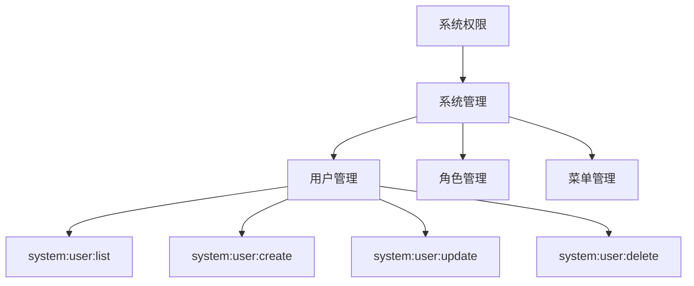

这张图表达的是：

- 菜单资源有层级
- 菜单下可以再挂按钮/接口权限码

---

## 22. 后台页面与 RBAC 的映射关系

前端页面通常有三类权限映射：

### 22.1 路由菜单

由菜单权限控制。

### 22.2 页面按钮

由按钮权限或权限码控制。

### 22.3 页面数据范围

由数据权限控制。

---

## 23. 前端权限加载设计图

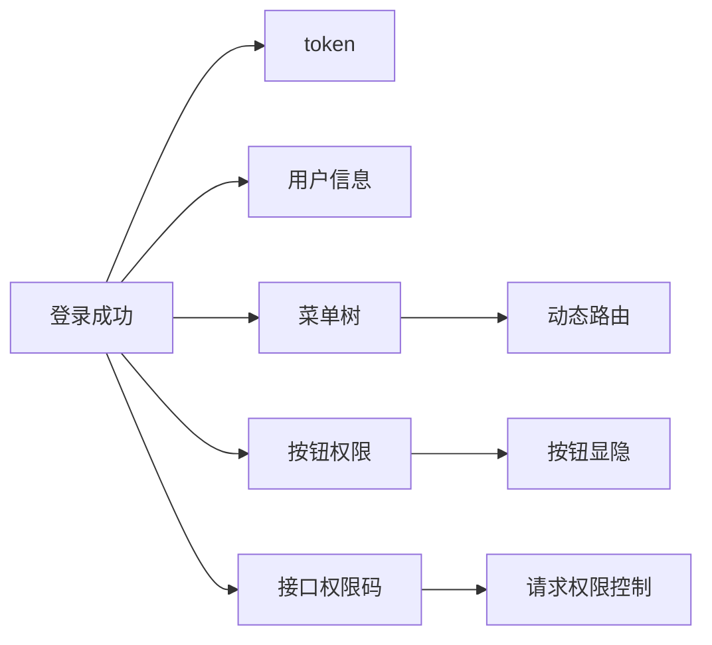

---

## 24. 后端权限中间件设计图

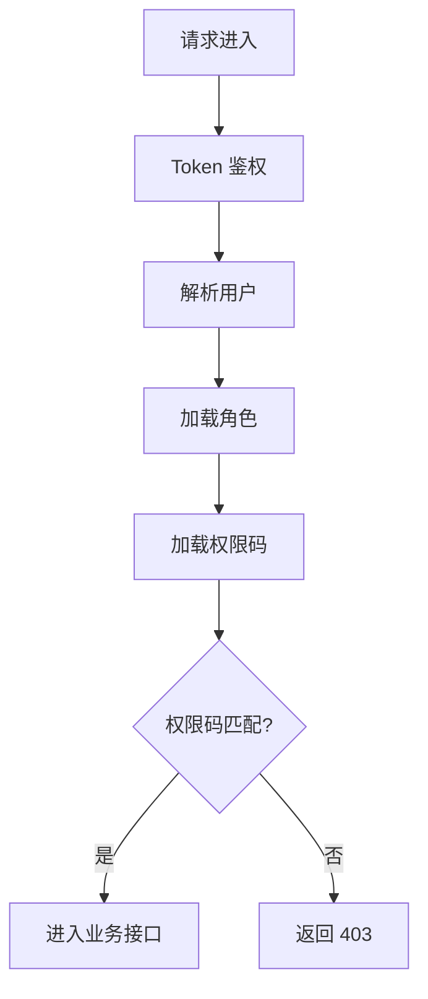

---

## 25. 当前项目如何升级为完整 RBAC

你当前项目可以按这条路线升级：

### 25.1 第一步

保留当前表：

- `Users`
- `Roles`
- `RouteAuth`
- `RoleRoute`
- `ButtonAuth`

### 25.2 第二步

补充统一权限码，例如：

- 菜单路径
- 按钮编码
- 接口编码

### 25.3 第三步

把用户角色改成多对多：

- 增加 `UserRole`

### 25.4 第四步

把按钮权限、接口权限逐步并入统一资源模型：

- 新增 `Permission`
- 新增 `RolePermission`

---

## 26. 推荐的最终 RBAC 模型图

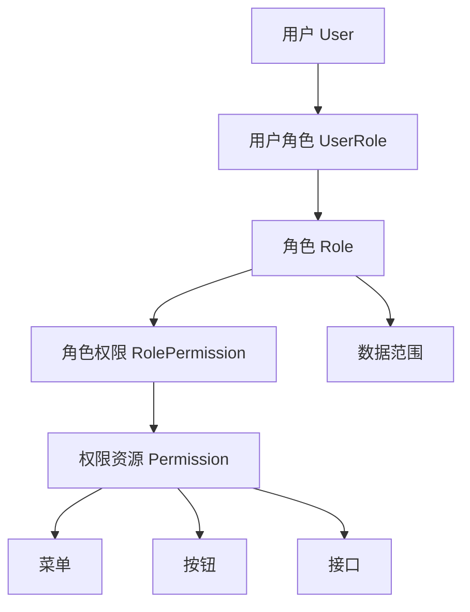

这个模型兼顾了：

- 页面菜单权限
- 页面按钮权限
- 后端接口权限
- 数据范围权限

适合完整后台系统长期演进。

---

## 27. RBAC 落地建议

如果你是要在这个项目里真正实现一套“长期可维护”的 RBAC，我建议这样做：

1. 后端先统一权限码规范
2. 后端中间件按权限码校验接口
3. 前端按菜单树渲染动态路由
4. 按钮显隐使用按钮权限码
5. 数据权限单独做范围过滤
6. 超级管理员角色统一处理

---

## 28. 小结

完整 RBAC 权限模型，本质上就是：

- 用户不直接绑权限
- 用户先绑角色
- 角色再绑权限
- 权限再细分为菜单、按钮、接口、数据范围

最推荐的一套后台权限抽象是：

```text
用户 -> 角色 -> 权限资源
                ├─ 菜单权限
                ├─ 按钮权限
                ├─ 接口权限
                └─ 数据权限
```

如果你愿意，我下一步可以继续给你补这三份任意一份：

- `RBAC 完整建表 SQL`
- `RBAC 权限初始化数据`
- `Koa 项目 RBAC 落地实现方案`
