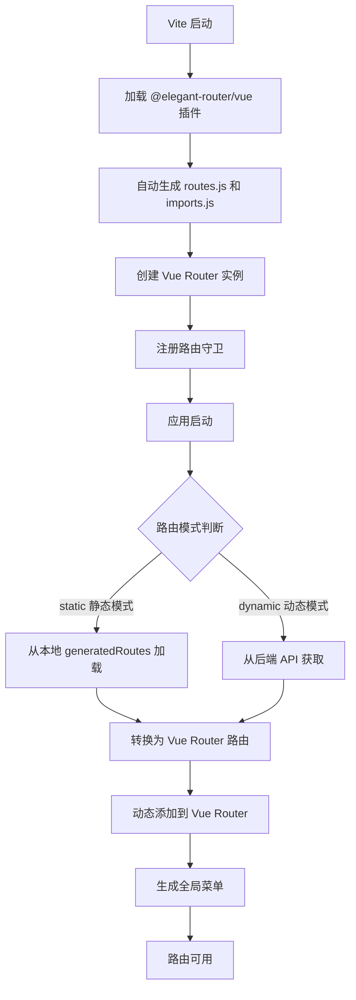
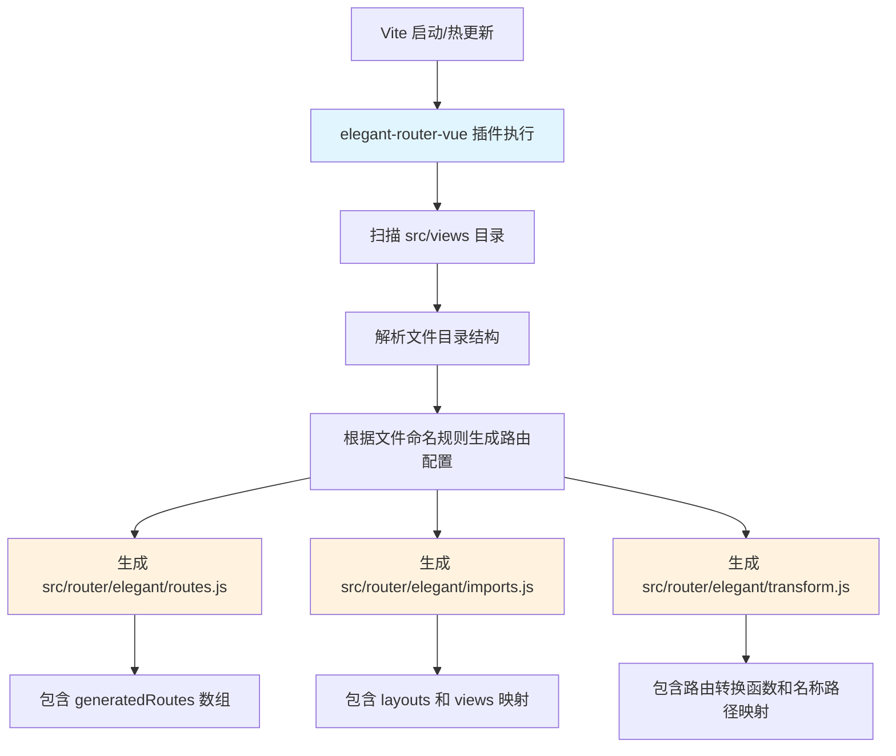
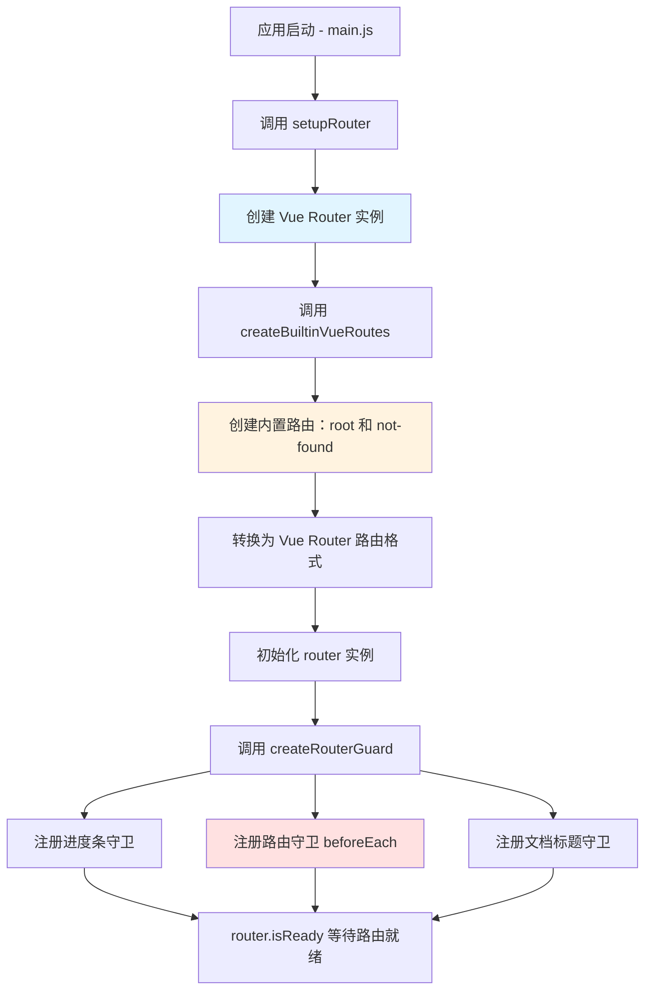
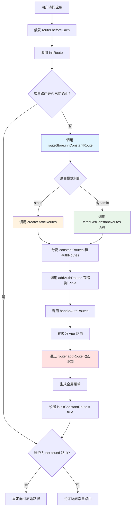
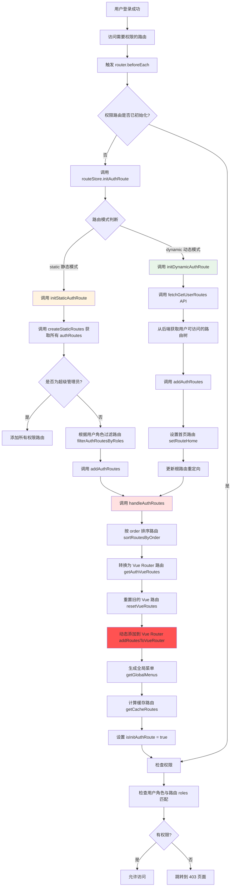
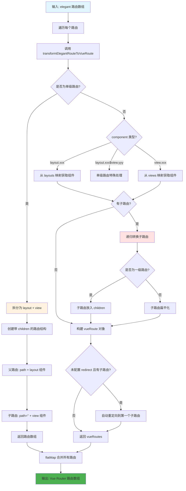
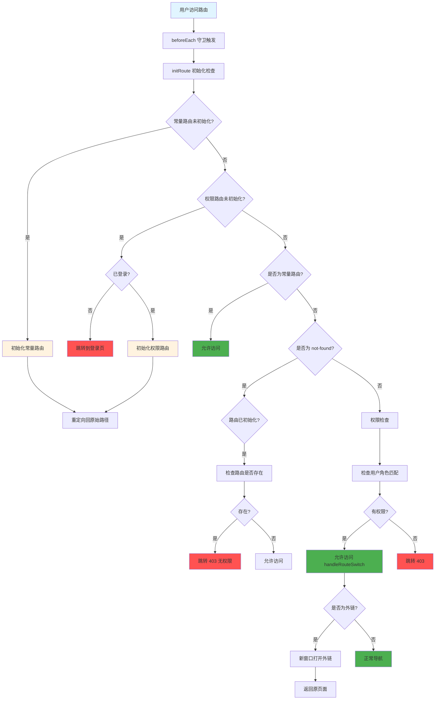
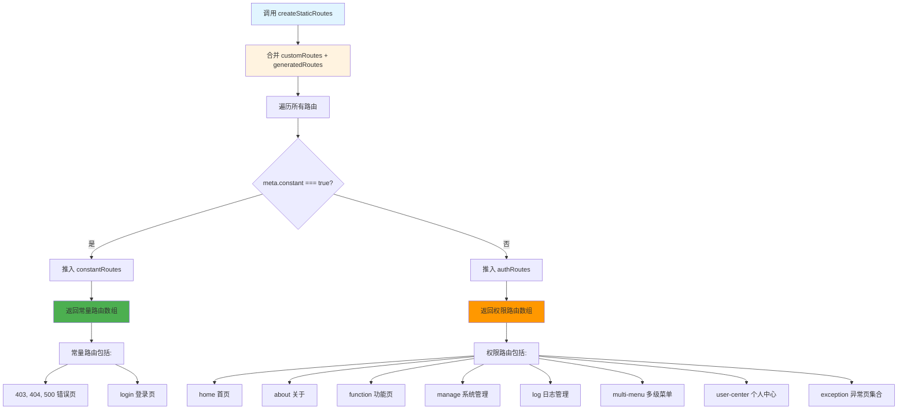
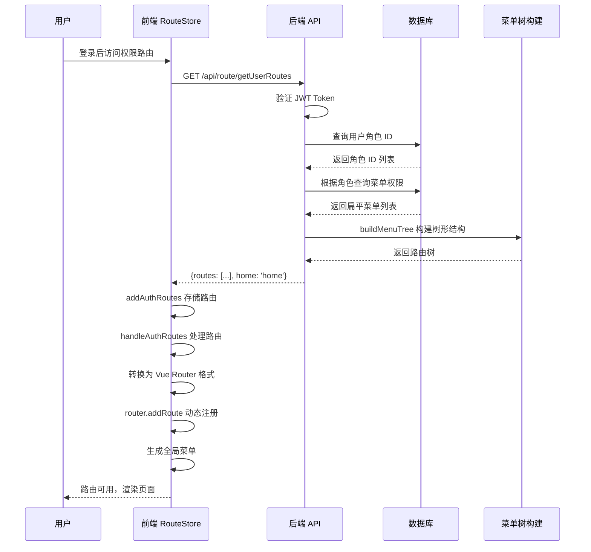
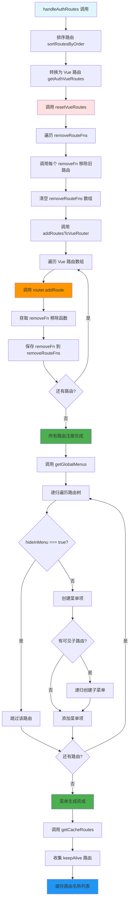

# 前端路由生成详细流程图

## 一、整体架构概览



## 二、详细流程分解

### 阶段 1：构建时路由自动生成（@elegant-router/vue 插件）



**生成的文件说明：**

- **routes.js**: 包含 `generatedRoutes` 数组，定义了所有自动生成的路由配置
  - 路由名称（name）
  - 路由路径（path）
  - 组件路径（component）：格式为 `layout.xxx$view.yyy` 或 `view.yyy`
  - 元信息（meta）：标题、图标、排序、权限角色等

- **imports.js**: 组件懒加载映射
  - `layouts`: 布局组件映射（base、blank）
  - `views`: 页面组件的懒加载函数映射

- **transform.js**: 路由转换工具
  - `transformElegantRoutesToVueRoutes`: 将 elegant 路由转换为 Vue Router 路由
  - `routeMap`: 路由名称与路径的双向映射表

### 阶段 2：Vue Router 初始化



**内置路由（builtin.js）：**

```javascript
ROOT_ROUTE = {
  name: 'root',
  path: '/',
  redirect: '/home',  // 由 VITE_ROUTE_HOME 环境变量决定
  meta: { title: 'root', constant: true }
}

NOT_FOUND_ROUTE = {
  name: 'not-found',
  path: '/:pathMatch(.*)*',
  component: 'layout.blank$view.404',
  meta: { title: 'not-found', constant: true }
}
```

### 阶段 3：路由守卫初始化（应用启动时）



### 阶段 4：权限路由初始化（登录后）



### 阶段 5：路由转换详细流程（transformElegantRoutesToVueRoutes）



**路由转换示例：**

```javascript
// 输入 - Elegant 路由（单级路由）
{
  name: 'home',
  path: '/home',
  component: 'layout.base$view.home',
  meta: { title: '首页', order: 1 }
}

// 输出 - Vue Router 路由
{
  path: '/home',
  component: BaseLayout,  // 从 layouts['base'] 获取
  children: [
    {
      name: 'home',
      path: '',
      component: () => import('@/views/home/index.vue'),  // 从 views['home'] 获取
      meta: { title: '首页', order: 1 }
    }
  ]
}
```

### 阶段 6：路由守卫完整判断流程



### 阶段 7：静态路由模式下的路由收集



### 阶段 8：动态路由模式下的后端交互



### 阶段 9：路由注册到 Vue Router 的完整流程



## 三、关键配置说明

### 环境变量配置

```bash
# .env 文件
VITE_AUTH_ROUTE_MODE=static          # 路由模式：static（静态）或 dynamic（动态）
VITE_ROUTE_HOME=home                 # 首页路由名称
VITE_ROUTER_HISTORY_MODE=history     # 路由历史模式：history 或 hash
VITE_BASE_URL=/                      # 应用基础路径
```

### 路由模式对比

| 特性 | static 静态模式 | dynamic 动态模式 |
|------|----------------|-----------------|
| 路由来源 | 本地 generatedRoutes | 后端 API 返回 |
| 适用环境 | 开发环境 | 生产环境 |
| 权限控制 | 前端根据 roles 过滤 | 后端根据用户角色返回 |
| 灵活性 | 较低 | 高 |
| 安全性 | 较低（路由配置暴露） | 高（后端控制） |

### 路由命名规范

```
一级路由: home, about, manage
二级路由: manage_user, manage_role, manage_menu
三级路由: multi-menu_first_child, function_hide-child_one
```

### 组件路径格式

```
单级路由: layout.base$view.home        → 展开为 layout + 默认子路由
带布局路由: layout.base                 → 使用 base 布局
视图路由: view.home                     → 直接使用 view 组件
```

## 四、核心函数调用链

### 1. 应用启动流程

```
main.js
  └─ setupRouter(app)
      ├─ createRouter({ routes: createBuiltinVueRoutes() })
      │   └─ transformElegantRoutesToVueRoutes([ROOT_ROUTE, NOT_FOUND_ROUTE])
      ├─ createRouterGuard(router)
      │   ├─ createProgressGuard
      │   ├─ createRouteGuard (beforeEach)
      │   └─ createDocumentTitleGuard
      └─ router.isReady()
```

### 2. 常量路由初始化流程

```
routeStore.initConstantRoute()
  └─ createStaticRoutes() 或 fetchGetConstantRoutes()
      └─ addAuthRoutes(constantRoutes)
          └─ handleAuthRoutes()
              ├─ sortRoutesByOrder(authRoutes)
              ├─ getAuthVueRoutes(sortRoutes)
              │   └─ transformElegantRoutesToVueRoutes(routes, layouts, views)
              │       └─ transformElegantRouteToVueRoute (递归)
              ├─ resetVueRoutes()
              ├─ addRoutesToVueRouter(vueRoutes)
              │   └─ router.addRoute(route) → removeFn
              ├─ getGlobalMenus(sortRoutes)
              └─ getCacheRoutes(vueRoutes)
```

### 3. 权限路由初始化流程

```
routeStore.initAuthRoute()
  ├─ initStaticAuthRoute()
  │   └─ createStaticRoutes()
  │       └─ filterAuthRoutesByRoles(routes, userInfo.roles)  // 非超级管理员
  │           └─ addAuthRoutes(filteredRoutes)
  │               └─ handleAuthRoutes()
  └─ initDynamicAuthRoute()
      └─ fetchGetUserRoutes()
          └─ addAuthRoutes(routes)
              └─ handleAuthRoutes()
```

### 4. 路由守卫判断流程

```
router.beforeEach(to, from, next)
  └─ initRoute(to)
      ├─ 初始化常量路由（如果未初始化）
      ├─ 初始化权限路由（如果未初始化且已登录）
      └─ 检查 not-found 路由
  └─ 权限检查
      ├─ 已登录访问登录页 → 跳转首页
      ├─ 常量路由 → 允许访问
      ├─ 未登录访问权限路由 → 跳转登录页
      ├─ 已登录且有权限 → 允许访问
      └─ 已登录无权限 → 跳转 403
```

## 五、特殊场景处理

### 1. 单级路由展开

```javascript
// 配置
{
  name: 'home',
  path: '/home',
  component: 'layout.base$view.home'
}

// 转换为
{
  path: '/home',
  component: BaseLayout,
  children: [{
    name: 'home',
    path: '',
    component: HomeView
  }]
}
```

### 2. 自动重定向

```javascript
// 未配置 redirect 的父路由
{
  name: 'manage',
  path: '/manage',
  component: 'layout.base',
  children: [
    { name: 'manage_user', path: '/manage/user' },
    { name: 'manage_role', path: '/manage/role' }
  ]
}

// 自动添加 redirect
{
  name: 'manage',
  path: '/manage',
  redirect: { name: 'manage_user' },  // 自动重定向到第一个子路由
  children: [...]
}
```

### 3. 路由缓存（keepAlive）

```javascript
// 配置 keepAlive
{
  name: 'manage_menu',
  path: '/manage/menu',
  component: 'view.manage_menu',
  meta: {
    title: '菜单管理',
    keepAlive: true  // 启用缓存
  }
}

// 收集到 cacheRoutes 数组
cacheRoutes = ['manage_menu']
```

### 4. 动态路由参数

```javascript
// 自动启用 props 透传
{
  name: 'manage_user-detail',
  path: '/manage/user-detail/:id',
  component: 'view.manage_user-detail',
  props: true  // 自动添加（如果包含 : 参数）
}
```

## 六、总结

前端路由生成的核心流程可以概括为以下几个阶段：

1. **构建时生成**：`@elegant-router/vue` 插件扫描 views 目录，自动生成路由配置
2. **Router 初始化**：创建 Vue Router 实例，注册内置路由（root、not-found）
3. **常量路由初始化**：应用启动时加载不需要权限的路由（登录页、错误页等）
4. **权限路由初始化**：登录后根据路由模式加载权限路由（静态过滤或动态获取）
5. **路由转换**：将 elegant 格式转换为 Vue Router 格式（处理布局、组件、子路由等）
6. **动态注册**：通过 `router.addRoute()` 动态添加路由到 Vue Router
7. **菜单生成**：根据权限路由生成全局菜单树
8. **守卫控制**：路由守卫负责权限验证、登录检查、路由初始化等

整个系统支持两种路由模式：
- **static 模式**：适合开发环境，路由配置在前端，根据角色过滤
- **dynamic 模式**：适合生产环境，路由由后端返回，更安全灵活
